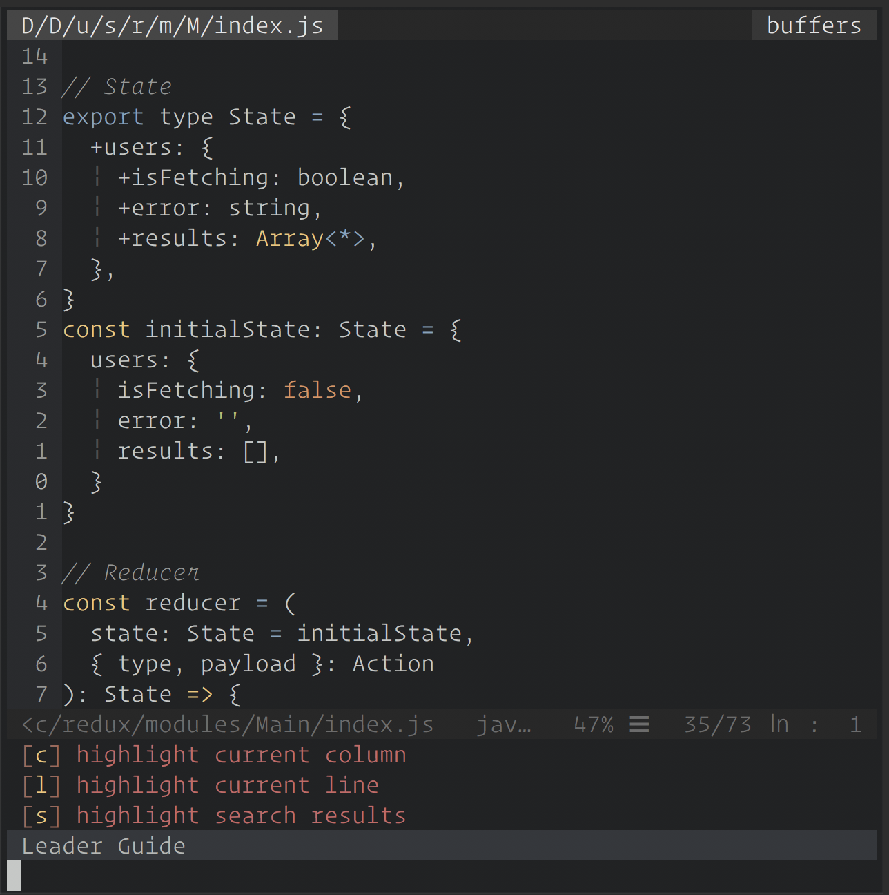

# SpaceCadetVim

**A lightweight Spacemacs-like Vim "distribution"**



## Features
- Simple, minimal `.vimrc` backed by [vim-sensible](https://github.com/tpope/vim-sensible)
- Fast, configurable leader guide
- fuzzy finder ([fzf](https://github.com/junegunn/fzf))
- minimalist aesthetics (with a few nice surprises)
- YouCompleteMe & vim-ale with eslint support

## Installation (targeting macOS for now)

### Dependencies

Install:
- Vim 8
- iTerm2 with [256-color and italic font support](https://alexpearce.me/2014/05/italics-in-iterm2-vim-tmux/)
- [fzf](https://github.com/junegunn/fzf#installation)
- latest [**MacVim**](https://github.com/macvim-dev/macvim/releases) and **CMake** for [YCM](https://github.com/Valloric/YouCompleteMe#installation)
  - CMake is available via Homebrew:
  ```bash
  brew update && brew install cmake
  ```
- Livedown (optional, only if you want to use [vim-livedown](https://github.com/shime/vim-livedown) for live Markdown editing)
  - `npm i -g livedown`
- [Iosevka](https://github.com/be5invis/Iosevka) font (optional)

Backup your configs:
```bash
cp -R ~/.vim ~/.vim.backup
cp -R ~/.vimrc ~/.vimrc.backup
```

Install [vim-plug](https://github.com/junegunn/vim-plug#vim):
```bash
curl -fLo ~/.vim/autoload/plug.vim --create-dirs \
    https://raw.githubusercontent.com/junegunn/vim-plug/master/plug.vim
```

Pull down the `.vimrc` and run `vim` to install plugins:
```
git clone https://github.com/zacacollier/space-cadet-vim/master/.vimrc ~/.vimrc && vim -c "PlugInstall"
```

### Usage

Workflow example:

1. Fuzzy-find a file while editing:

```vim
<Space-f-f> (start typing)
```

2. Tab up / down in FZF's dialog and open the file in a new tab:

```vim
<C-p> / <C-n>,  <C-t>
```

3. Quickly move between tabs (left and right):

```vim
<Shift-H> / <Shift-L>
```

4. Open or close error dialog in the `loclist`:

```vim
<Space-e-l> / <Space-e-c>
```

### Configuration

#### Leader Guide

[vim-leader-guide](https://github.com/hecal3/vim-leader-guide) provides an
impressively configurable API, and the help doc certainly warrants a
read-through if you're interested in performing more sophisticated
configurations.

However, I've taking a relatively pedestrian approach to mapping custom leader keys which works well enough for my intents and purposes.

The Leader Guide is configured in the bottom section of the `.vimrc`, where each Leader Group is grouped by **order of appearance** in the Leader Guide at runtime:

```vim
""" Leader Guide {{{
  ...
  "" Add more Leader Groups here:

  " Files
  let g:lmap.f = { 'name': 'files' }
    nnoremap <silent>! <leader>f<CR>

    let g:lmap.f.d = ['e $HOME/.vimrc', 'edit $HOME/.vimrc']
    nnoremap <silent>! <leader>fd<CR>

    let g:lmap.f.R = ['source $HOME/.vimrc', 'refresh .vimrc']
    nnoremap <silent>! <leader>fR<CR>

    let g:lmap.f.f = ['FZF', 'fzf']
    nnoremap <silent>! <leader>ff<CR>

    let g:lmap.f.t = ['NERDTreeToggle', 'NERDtree']
    nnoremap <silent>! <leader>ft<CR>
  "
```

Under the `" Files` header, the leftmost-indented binding defines the **Leader Group Key** and **Name** within the global `lmap` dictionary that tracks custom Leader mappings:

```vim
  " Files
  let g:lmap.f = { 'name': 'files' }
    nnoremap <silent>! <leader>f<CR>
```

Basically, this configures `<Space> f <Enter>` to open the `[f] files` Leader Group, within which are contained the following four `<leader>`-bound commands:

```vim
    let g:lmap.f.d = ['e $HOME/.vimrc', 'edit $HOME/.vimrc']
    nnoremap <silent>! <leader>fd<CR>

    let g:lmap.f.R = ['source $HOME/.vimrc', 'refresh .vimrc']
    nnoremap <silent>! <leader>fR<CR>

    let g:lmap.f.f = ['FZF', 'fzf']
    nnoremap <silent>! <leader>ff<CR>

    let g:lmap.f.t = ['NERDTreeToggle', 'NERDtree']
    nnoremap <silent>! <leader>ft<CR>
```

Each `let` binding takes an array with the **leader command at the first index** followed by the **leader's title (`alias` if you will) at the second**.

The end result looks something like this:

```
[d] edit $HOME/.vimrc     [f] fzf                   [R] refresh .vimrc        [t] NERDtreeToggle
```

You can also nest groups inside of groups (insert obligatory DMX "yo dawg we herd u like" meme here):

```vim
  " UI
  let g:lmap.u = { 'name': 'UI' }
  nnoremap <silent>! <leader>u<CR>
    let g:lmap.u.h = { 'name': 'highlighting' }
    nnoremap <silent>! <leader>uh<CR>

      let g:lmap.u.h.l = ['setlocal invcursorline', 'highlight current line']
      nnoremap <silent>! <leader>uhl<CR>
  ...

```

That's all there is to it!

**Note**: as you write Leader group mappings, take care that you don't forget the bang `!` in `nnoremap <silent>!` - otherwise each mapping will `echo` at you every time you run Vim.


### Known issue with YCM
`vim-leader-guide` tries to predictively generate new entries for the Leader
Guide - however, if your YCM isn't configured to support the current filetype,
it'll instead produce an innocuous `[d] YcmShowDetailedDiagnostic` mapping
which, when invoked, will read back a log from YCM letting you know it couldn't
automatically read the file. This minor UI blemish can likely be configured away,
though it hasn't affected performance or anything for me so far.
